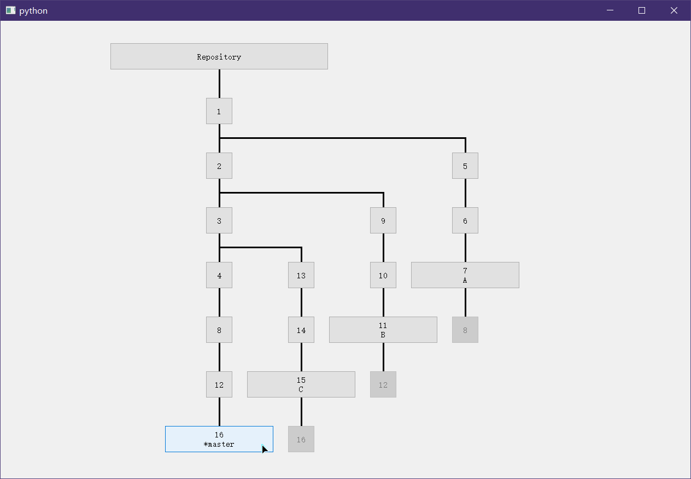
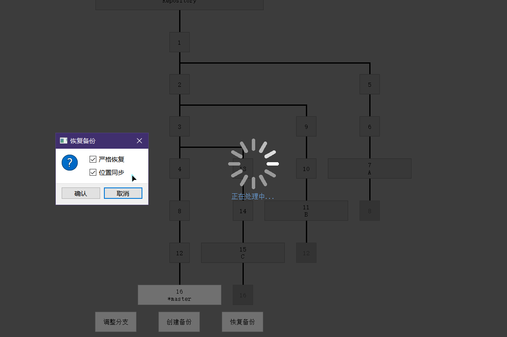

### 本项目：
- 基于PyQt5；
- Python版本为3.7.8；
- 依赖个人的另一个项目XJ_Python，但已将依赖代码单独提取；
- 底层的备份基于git，或者说它就是git仓库可视化，但也只是完成简单的功能，复杂的仓库不一定能正常加载；
- 运行项目中的main.py即可；

### 运行截图：

#### 说明：
- 右键按下即可拖拽画面；
- 每个节点代表一个提交(除了根节点)；
- 根节点用于切换路径，它指示当前仓库所在目录，点击即可弹出窗口选择路径；
- 点击提交节点可执行“恢复”、“分支切换”、“备份创建”，其中后两个操作必须在当前提交节点上进行；
- 标注有星号*的节点即为当前节点，并且说明此时HEAD的指向，是游离亦或是指向某一分支；
- 灰色提交节点不可操作，它所代表的含义是“父节点被merge到对应节点上”，例如节点8是节点4和7通过merge得到的结果。毕竟有环图的绘制过于复杂，为了避免显示过于杂乱便将环给打断；
- 恢复备份时出现的“位置同步”意思是切换恢复备份的同时移动当前位置，“严格恢复”是将那些未跟踪的文件一并删除以得到和提交状态一模一样的目录结构；

